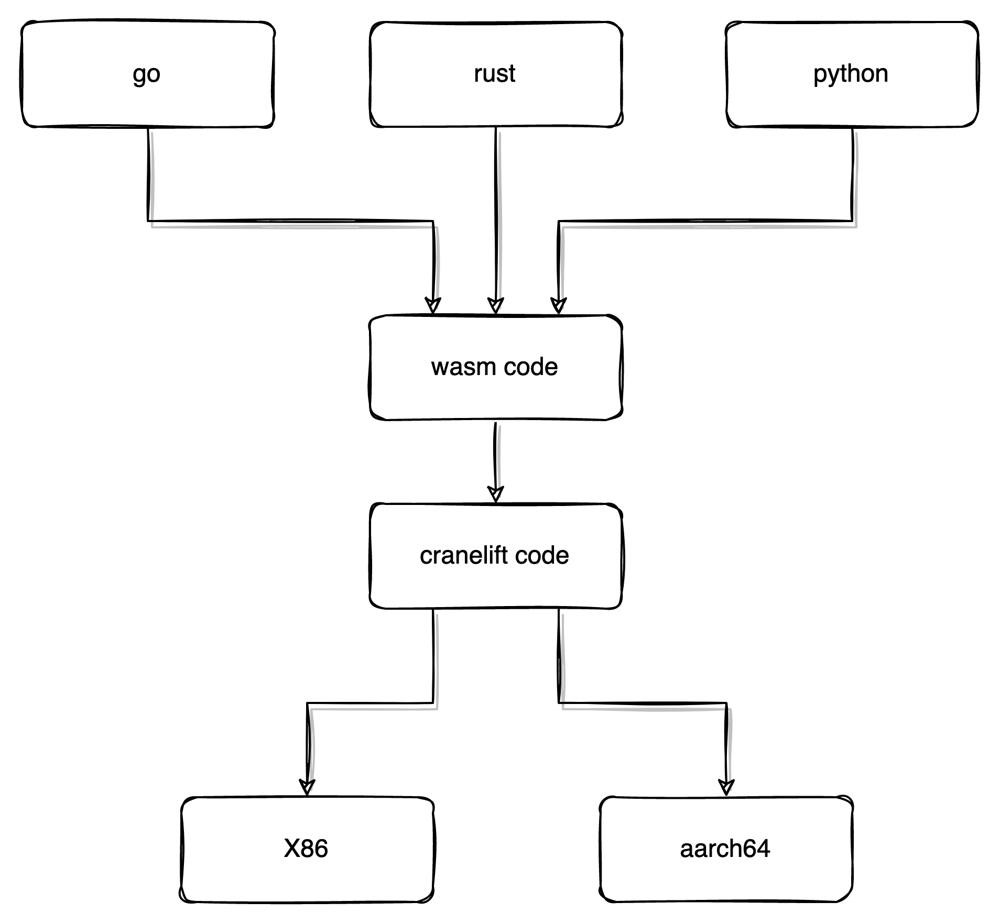

#fvm

## 大致流程

## 结构

## 系统调用

https://github.com/filecoin-project/ref-fvm/blob/master/fvm/src/syscalls

## gas计算 

1. 合约内通过在插入gas global树，和减gas的函数。 没米格代码块的前面插入调用gas的函数
2. 合约外部每次系统调用会获取，计算，更新

保证了效率和准确性

## 内存及限制

按需或批量分配， 通过mmap映射已经分配的空间。 合约需要的时候通过mmap在这个内存池里面获取。
存在一个内存限制器，可以有用户自己实现，可以通过这个来控制内存容量。
